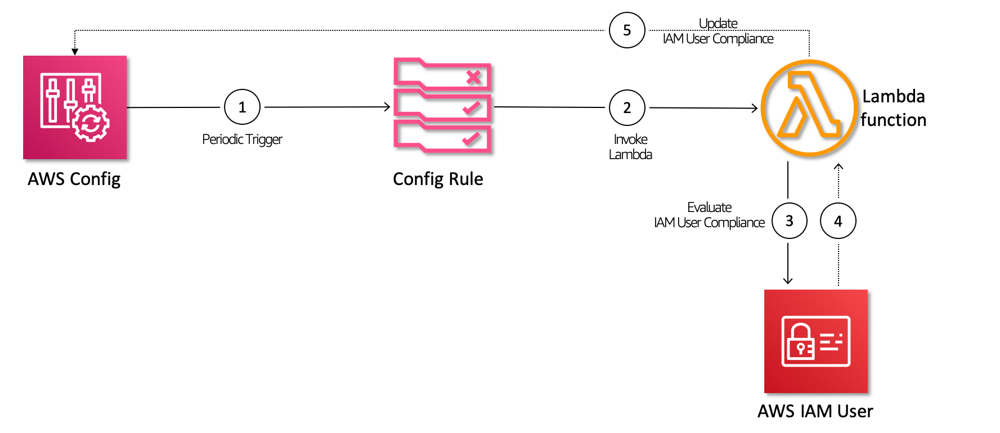

# Security Automation: Monitor User with Excessive Privileges

 Identify IAM User[s] who might have `Action:['*']`  or `Resource:['*']` permissions.

   

  Follow this article in **[Youtube](https://youtube.com/c/ValaxyTechnologies)**

1. ## SetUp Dev Environment

    Setup the custom rule. Make sure you have `AWS CLI` profile configured. You should have at [minimum these permissions](https://github.com/awslabs/aws-config-rdk/blob/master/policy/rdk-minimum-permissions.json) before executing below commands

    ```sh
    git clone https://github.com/miztiik/security-automation-monitor-users-with-excessive-privileges.git
    cd security-automation-monitor-users-with-excessive-privileges
    dir_name="mystique-infosec"
    custom_rule_name="monitor_users_with_excessive_privileges"

    # If you dont have venv installed already
    # pip install virtualenv

    python3 -m venv ${dir_name}
    cd ${dir_name}
    source bin/activate
    pip3 install rdk

    # Configure AWS Profile
    rdk init

    # Lets create a LOCAL rule
    rdk create ${custom_rule_name} --runtime python3.7 --resource-types AWS::IAM::User
    ```

1. ## Copy the `Config Rule code`

    Copy the file under `lambda_src` to the directory `${custom_rule_name}` directory that was created now. The `custom_rule_name` and this file-name should be the SAME.

1. ## Deploy the custom rule

    ```sh
    rdk deploy ${custom_rule_name}
    ```

1. ## Test the rule

    1. Create a new user(or we can use any existing user)
    1. Add a bad inline policy to the user.
        - A sample policy `bad_policy.json` can be found in `sample_events` directory
    1. Wait for `AWS Config` to evaluate the user and identify it as :x: `Noncompliant`

1. ## Resource Cleanup

    1. Delete CloudWatch Lambda LogGroups
    1. Delete the stack[s] - If you want to destroy all the resources created by the stack, Execute the below command to delete the stack, or _you can delete the stack from console as well_

      ```sh
      rdk undeploy ${custom_rule_name}
      ```

### Buy me a coffee

Buy me a coffee ☕ through [Paypal](https://paypal.me/valaxy), _or_ You can reach out to get more details through [here](https://youtube.com/c/valaxytechnologies/about).

### References

1. [AWS Config RDK - Getting Started - Blog](https://aws.amazon.com/blogs/mt/how-to-develop-custom-aws-config-rules-using-the-rule-development-kit/)
1. [AWS Config RDK - Getting Started - Git](https://github.com/awslabs/aws-config-rdk)
1. [Git Repo of Config Rules in Python-01](https://github.com/awslabs/aws-config-rules/tree/master/python)
1. [Git Repo of Config Rules in Python-02](https://github.com/dome9/cloud-bots/tree/master/bots)

### Metadata

**Level**: 200
